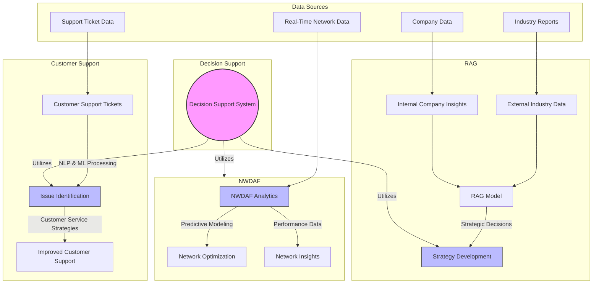

### Flowchart [<a href="https://mermaid.live/edit#pako:eNqVVGtr2zAU_StChdFCUpbYThx_GJR6G4W-qDsGS4pR7etE1LaMJKdxH_99svzMo2XzJ90j3XN1zr3WKw5YCNjBS06yFbp3FylSn8gfK8CFgArKUuTlWca4rLbLz_WOj3d3kVcICcnJSXUM0nCR7hBe_3bPfnQsOvTPUhIXkgZirmPUxg9oOPz2dsshpIGka0BX6rYxTZdv6BrkM-NP_k0maUJfiFT3mNcg6oMPH1aryIFHjCckDQC5RJKO-SIVdLmSomVtgIeP5Z3nQrIE-L5f9zR4AkW2e6LZqKReX96iL-jqEt1yFoAQWuqFEDkI_yKEVNKIBpVWjaJtsKf1YJKu0d0A-Joq2Z7kRMKSglC1koyzNYR-fb15A-xJ-8SFu7Of3UW-byRwZblfujtvImVmqAh5oU3X4ss0Xzd4rlZVq_uC0pqn7UuDoHOWZCQtugZt03UcLaSNaHQH7ZgrA2qw8F1YQ8yyRPk3b0DUAz_RX0pCHsu5amGvOJD4niagfSiDYRk149bzYWdMO4baeU2wPT697Hqe-sZVTt9BmVDaVjtfA1XaVpu65NpaXbKxuau115M9T1xPW_1L0pi-lAPWewD29g7O7AdnD_WpbYQsYihTIhrHzlE0iwZKMHsC58gwjHo9fKahXDnjbNNP2n0iKobHx08YRtsMh3-8_-c5JPAfafAAqx81ITRUL_trSbrAcgUJLLCjliFEJI_lAi_Sd3WU5JJ5RRpgJyKxgAHOs1BVdilR05y0qGr9H8ZULHlehdh5xRvsTMxTyzat6cycTKdTwzQHuMDOaGScmtbYsg1jNJ7Z9th-H-AXTfD1dGZPbGM6sUzDmloTw3j_C1fyNQg">live editor</a>]

```
graph TD
    subgraph Decision Support
        DS((Decision Support System))
    end

    subgraph NWDAF
        NWDAF_Analytics[NWDAF Analytics] -->|Predictive Modeling| Network_Optimization[Network Optimization]
        NWDAF_Analytics -->|Performance Data| Network_Insights[Network Insights]
    end

    subgraph Customer Support
        Tickets[Customer Support Tickets] -->|NLP & ML Processing| Issues_Identification[Issue Identification]
        Issues_Identification -->|Customer Service Strategies| Improved_Support[Improved Customer Support]
    end

    subgraph RAG
        External_Data[External Industry Data] --> RAG_Model[RAG Model]
        Internal_Insights[Internal Company Insights] --> RAG_Model
        RAG_Model -->|Strategic Decisions| Strategy_Development[Strategy Development]
    end

    subgraph Data Sources
        RealTimeData[Real-Time Network Data] --> NWDAF_Analytics
        SupportData[Support Ticket Data] --> Tickets
        IndustryReports[Industry Reports] --> External_Data
        CompanyData[Company Data] --> Internal_Insights
    end

    DS -->|Utilizes| NWDAF
    DS -->|Utilizes| Issues_Identification
    DS -->|Utilizes| Strategy_Development

    style DS fill:#f9f,stroke:#333,stroke-width:2px
    style NWDAF_Analytics fill:#bbf,stroke:#333,stroke-width:1px
    style Issues_Identification fill:#bbf,stroke:#333,stroke-width:1px
    style Strategy_Development fill:#bbf,stroke:#333,stroke-width:1px
```


