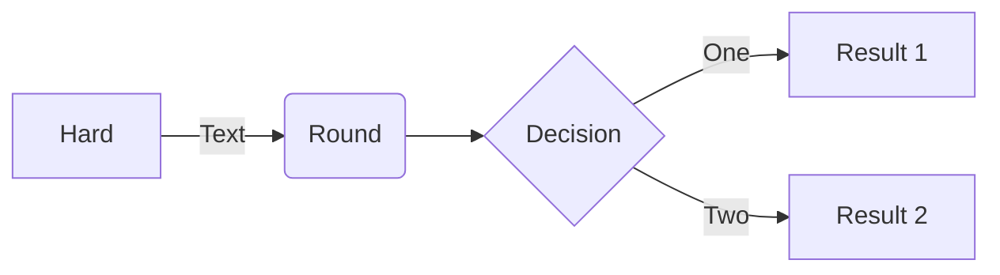

### Flowchart [<a href="https://mermaid-js.github.io/mermaid/#/flowchart">docs</a> - <a href="https://mermaid.live/edit#pako:eNpNkMtqwzAQRX9FzKqFJK7t1km8KDQP6KJQSLOLvZhIY1tgS0GWmgbb_165IaFaiXvOFTPqgGtBkEJR6zOv0Fj2scsU8-ft8I5G5Gw6fe339GN7tnrYaafE45WvRsLW3Ya4bKVWwzVe_xU-FfVsc9hR62rLwvw_2591z7Y3FuUwgYZMg1L4ObrRzMBW1FAGqb8KKtCLGWRq8Ko7CbS0FdJqA2mBdUsTQGf110VxSK1xdJM2EkuDzd2qNQrypQ7s5TQuXcrW-ie5VoUsx9yZ2seVtac2DYIRz0ppK3eccd0ErRTjD1XfyyRIomSBUUzJPMaXOBb8GC4XRfQcFmL-FEYIwzD8AggvcHE">live editor</a>]

```
graph TD
    subgraph Decision Support
        DS((Decision Support System))
    end

    subgraph NWDAF
        NWDAF_Analytics[NWDAF Analytics] -->|Predictive Modeling| Network_Optimization[Network Optimization]
        NWDAF_Analytics -->|Performance Data| Network_Insights[Network Insights]
    end

    subgraph Customer Support
        Tickets[Customer Support Tickets] -->|NLP & ML Processing| Issues_Identification[Issue Identification]
        Issues_Identification -->|Customer Service Strategies| Improved_Support[Improved Customer Support]
    end

    subgraph RAG
        External_Data[External Industry Data] --> RAG_Model[RAG Model]
        Internal_Insights[Internal Company Insights] --> RAG_Model
        RAG_Model -->|Strategic Decisions| Strategy_Development[Strategy Development]
    end

    subgraph Data Sources
        RealTimeData[Real-Time Network Data] --> NWDAF_Analytics
        SupportData[Support Ticket Data] --> Tickets
        IndustryReports[Industry Reports] --> External_Data
        CompanyData[Company Data] --> Internal_Insights
    end

    DS -->|Utilizes| NWDAF
    DS -->|Utilizes| Issues_Identification
    DS -->|Utilizes| Strategy_Development

    style DS fill:#f9f,stroke:#333,stroke-width:2px
    style NWDAF_Analytics fill:#bbf,stroke:#333,stroke-width:1px
    style Issues_Identification fill:#bbf,stroke:#333,stroke-width:1px
    style Strategy_Development fill:#bbf,stroke:#333,stroke-width:1px
```


