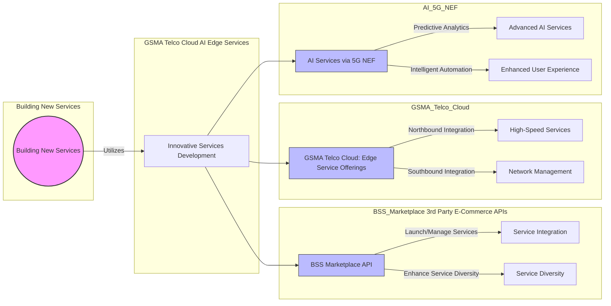

### Flowchart [<a href="https://mermaid.live/edit#pako:eNqVVF1vmzAU_SuW-9JKSReShgQeJtE26yK1WTXWl5EIOdgEq46NjEmbfvz3XT5C6Oc2XsDH55577_E1jzhSlGEXrzRJE3T5cy4RPFm-rIDTnAvK5QrN2B3ymd7wiGUVp3hOZ_7h4buco6OKxSSdy9eivh9eEX3LTCpIxNBAU3RNtNmiSfdMrddMA-hdT9uJIASQAN6oHQrYAnW7X58uSS6j5MsVkWTFmiqedl_hVBoG2Q1XMqgx1MIWb1KVqhOZEBk1euicb5jOuNnuhRsoeENafGzBhX_lhb-YiFR4JlRO9-kndMVCcCHNDXgaFERUElFJdEtCU9CPOGYaeFnlwkxpkyxVLmm7uSf0na-S0E8Zo-HOmqDAuiXW2LX4qIxS3Ff5u-IzZu6Uvg0r79dMmqCG0B76xAtvGg4vwtnk2z47QLAOvGlTGtpwgoYXCOCq1WvNKI8MeI08ScTW8AiO26Ob4sBoCApNpzsQtfQWr5OVokVfQvAVFIy83Kh13WI9BzS8yZgOJ_cpmM4ACHYbqNhA-42_HH37RIuq2mfamnq4UPsuplKqDSkbbkw5ZxsmVFoaXDSwG973JUrGy4P9hFjZ8qYPuPKlVTeGC_5QXLF2ZNOt2QpWcmMuhHsQO3EnM1rdMvdgMBjU3907Tk3i9tP7F1H1Bawil8tPIq2Xka-G9v8F6lH410DcwfCzWhNO4Q_6WAjNsUlg3ufYhU_KYpILM8dz-QxUAgPlb2WE3ZiIjHVwnlJi2DknMBjrBk2J_K0UrI3OqyV2H_E9dm372O73-4OxNXSskWM7HbzFrjM-PhnajmWPe05v3O8Nnjv4oYzvHY-dkdUfWqOTE8e2x9bo-Q8eS_fZ">live editor</a>]

```
graph LR
    subgraph Building New Services
        BNS((Building New Services))
    end

    subgraph BSS_Marketplace 3rd Party E-Commerce APIs
        BSS_API[BSS Marketplace API] -->|Launch/Manage Services| Service_Integration[Service Integration]
        BSS_API -->|Enhance Service Diversity| Service_Diversity[Service Diversity]
    end

    subgraph GSMA_Telco_Cloud
        Edge_Computing[GSMA Telco Cloud: Edge Service Offerings] -->|Northbound Integration| High_Speed_Services[High-Speed Services]
        Edge_Computing -->|Southbound Integration| Network_Management[Network Management]
    end

    subgraph AI_5G_NEF
        AI_NEF[AI Services via 5G NEF] -->|Predictive Analytics| Advanced_AI_Services[Advanced AI Services]
        AI_NEF -->|Intelligent Automation| Enhanced_User_Experience[Enhanced User Experience]
    end

    subgraph GSMA Telco Cloud AI Edge Services
        New_Services[Innovative Services Development] --> BSS_API
        New_Services --> Edge_Computing
        New_Services --> AI_NEF
    end

    BNS -->|Utilizes| New_Services

    style BNS fill:#f9f,stroke:#333,stroke-width:2px
    style BSS_API fill:#bbf,stroke:#333,stroke-width:1px
    style Edge_Computing fill:#bbf,stroke:#333,stroke-width:1px
    style AI_NEF fill:#bbf,stroke:#333,stroke-width:1px

```


