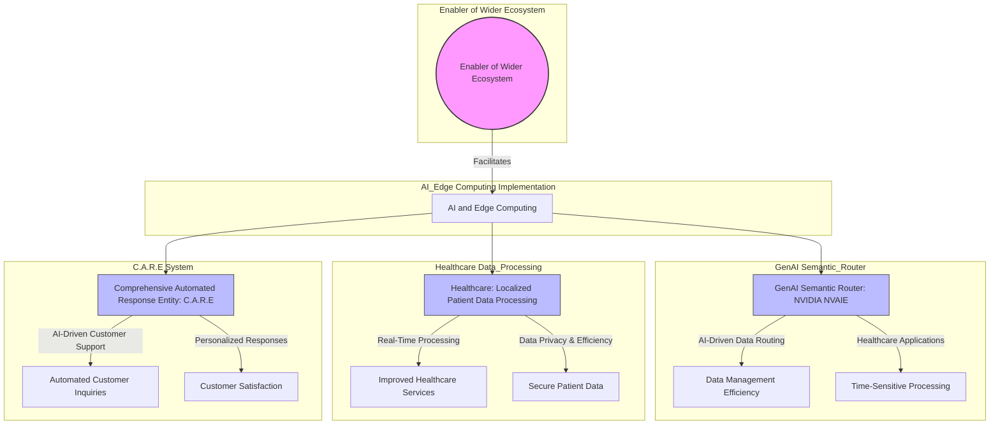

### Flowchart [<a href="https://mermaid.live/edit#pako:eNqVVF1vmzAU_SuWJ02tlESBrGngYRJK2Ia0VVVStdJIhBwwiTWwGZistOl_38WQAG0abbxg-55z77kf9jP2RUCxiTcpSbbobrbkCL4sX1cHNifriKZIhOiBBbCwfZEVmaRxBSw_-8G-uHgfeHlZQSkPlvyV-6-UWw5a0JhwyXxvLnJJ08bzzb0zcyzv5t5ybLeLRRXWrDFIYVao3_-8t5z-LGU7ytGMSKKAjG_2auf9IJxsaEy59OwwZD6j3C9cBWxMqDGtTqtRgb5REsmtT1KKrCSJmE8kEzzbozsWU29BecYk6PBuU-HTLAMRbmnpHy2osazeL1IrjEqhITXavgufROyJBu1gDdFsAOgWVJY5qpxbAlRKc6D0S5Etyx45cZKKHThvPEJ66Y4Bwj0Y2zoPxtV5hSpkrYPtiF-gj63S78GNn0OoWrFXIt3qrJPFmdpNB9ZgPrDR4tXMWo43tea2OxWgnm7LhkA7rFyKmEjIZU6zBFpJ4QJIJgvz4Oj1hE3zDCgw7os8SUQq940Pz-G_c5YyKFHj94g_GldvRKkQtzTNBK9bdlADo3Vw4C2gAFlI_HLk3EZG6_RMWSCSHWwoKtNXt6NscaRmX81wR1OJdOHqER6gLktVo3Mv3hAV4lTvTyPrErxRDm-MKssX4rOIgciyFjXxmJ0sIqqQIYsi80NohL1MpuIXNT-MRqN63f_DArk19eSxzerc7Yq-Xp-ha136yeH-fzeHAfhXJu5haHpMWAAv-HPpaYnlFtq4xCYsAxqSPJJLvOQvACUwhYuC-9gMSZTRHs6TAAo5YwSGIj6eJoT_FAL2Ms2rLTaf8SM2x-PBWNf10US7MrRrY2z0cIFNYzL4dDU2tPFkaAwn-nD00sNPij8cTIxrTb_SNR1-2lB7-QtkxSV1">live editor</a>]

```
graph TD
    subgraph Enabler of Wider Ecosystem
        EWE((Enabler of Wider Ecosystem))
    end

    subgraph GenAI Semantic_Router
        NVIDIA_NVAIE[GenAI Semantic Router: NVIDIA NVAIE] -->|AI-Driven Data Routing| Data_Management_Efficiency[Data Management Efficiency]
        NVIDIA_NVAIE -->|Healthcare Applications| Time_Sensitive_Processing[Time-Sensitive Processing]
    end

    subgraph Healthcare Data_Processing
        Localized_Processing[Healthcare: Localized Patient Data Processing] -->|Real-Time Processing| Improved_Healthcare_Services[Improved Healthcare Services]
        Localized_Processing -->|Data Privacy & Efficiency| Secure_Patient_Data[Secure Patient Data]
    end

    subgraph C.A.R.E System
        AI_CARE[Comprehensive Automated Response Entity: C.A.R.E] -->|AI-Driven Customer Support| Automated_Inquiries[Automated Customer Inquiries]
        AI_CARE -->|Personalized Responses| Customer_Satisfaction[Customer Satisfaction]
    end

    subgraph AI_Edge Computing Implementation
        AI_Edge[AI and Edge Computing] --> NVIDIA_NVAIE
        AI_Edge --> Localized_Processing
        AI_Edge --> AI_CARE
    end

    EWE -->|Facilitates| AI_Edge

    style EWE fill:#f9f,stroke:#333,stroke-width:2px
    style NVIDIA_NVAIE fill:#bbf,stroke:#333,stroke-width:1px
    style Localized_Processing fill:#bbf,stroke:#333,stroke-width:1px
    style AI_CARE fill:#bbf,stroke:#333,stroke-width:1px

```


